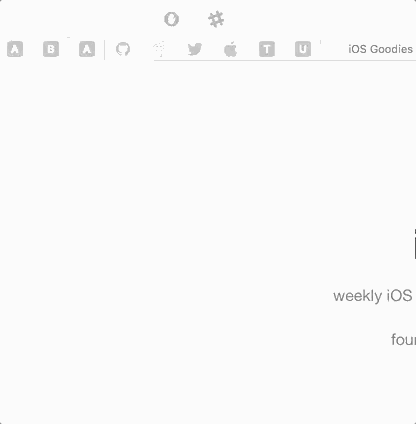

Slackfari is a Safari Extension to communicate quickly with your teams, written in Swift.

The idea behind Slackfari is to quickly send awesome posts or messages to our teams directly from Safari. Besides, I've created a small pod called [SlackWebAPIKit](https://github.com/MoralAlberto/SlackWebAPIKit) to reuse in iOS, macOS or tvOS projects.

## Create Token
Generate token with Slack Token Generator [Slack](https://api.slack.com/custom-integrations/legacy-tokens), you will see the next image

**this token is mandatory in order to send message in our team**

## Features
- [x] Sent message to users
- [x] Sent message to public channels
- [x] Sent message to private channels (groups)
- [x] Add multiple teams

##Component Libraries
Slackfari uses **RxSwift**. Why? I love the simplicity of reactive programming.

## Requirements
- iOS 9.0+ / macOS 10.10+ / tvOS 9.0+
- Xcode 8.3+
- Swift 3.2+

## Communication
- If you **need help**, use [Stack Overflow](http://stackoverflow.com/questions/tagged/slackfari). (Tag 'slackfari')
- If you'd like to **ask a general question**, use [Stack Overflow](http://stackoverflow.com/questions/tagged/slackfari).
- If you **found a bug**, open an issue.
- If you **have a feature request**, open an issue.
- If you **want to contribute**, submit a pull request.

