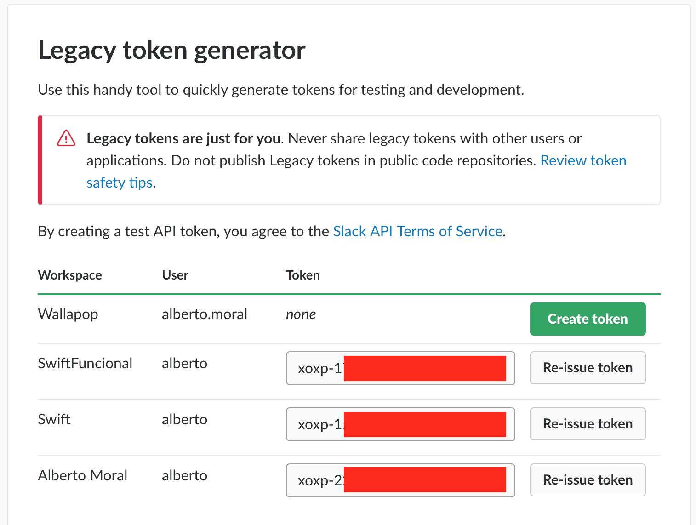
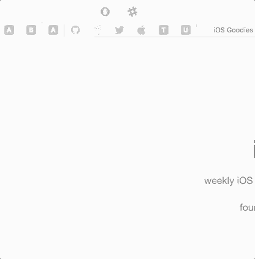

**Send It - for Slack** is a Safari Extension to communicate quickly with your teams, written in Swift. You can download from [App Store](https://itunes.apple.com/us/app/send-it-for-slack/id1293799461?l=es&ls=1&mt=12)

The idea behind **Send It - for Slack** is to quickly send awesome posts or messages to our teams directly from Safari. Besides, I've created a small pod called [SlackWebAPIKit](https://github.com/MoralAlberto/SlackWebAPIKit) to reuse in iOS, macOS or tvOS projects. Building the project is super simple, **compile the project with SafariExtension target**

## Create Token
Generate token with Slack Token Generator [Slack](https://api.slack.com/custom-integrations/legacy-tokens), you will see the next image

**this token is mandatory in order to send messages in your team**

## Features
- [x] Sent message to users
- [x] Sent message to public channels
- [x] Sent message to private channels (groups)
- [x] Add multiple teams
- [x] Delete team

## Requirements
- iOS 9.0+ / macOS 10.10+ / tvOS 9.0+
- Xcode 8.3+
- Swift 3.2+

## Communication
- If you **need help**, use [Stack Overflow](http://stackoverflow.com/questions/tagged/send-it-for-slack). (Tag 'send-it-for-slack')
- If you'd like to **ask a general question**, use [Stack Overflow](http://stackoverflow.com/questions/tagged/send-it-for-slack).
- If you **found a bug**, open an issue.
- If you **have a feature request**, open an issue.
- If you **want to contribute**, submit a pull request.

